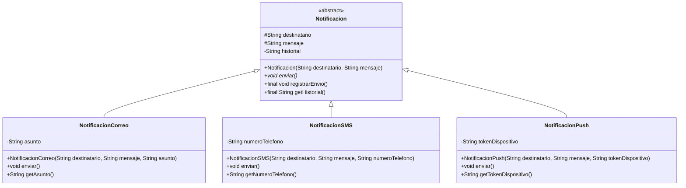
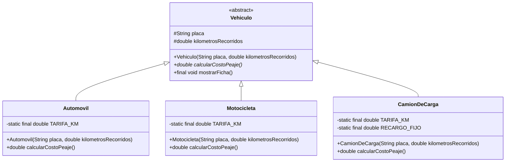

# Guía de Trabajo Práctico — Programación III — Semana 8

**Unidad II (Semanas 5 a 8): Clases Abstractas y Herencias — Contenido 2.4: Diseño de clases abstractas**
**Fuente:** `Semana8_GuiaTrabajo_ProgramacionIII_UPED.pdf` (18 páginas, docente: Ing. Oscar Armando Contreras Álvarez, ciclo 02-2026).

La Semana 8 **no introduce sintaxis nueva** de Java: integra en un solo procedimiento (el *checklist de decisión de tres preguntas*) todo lo aprendido en las Semanas 5, 6 y 7. La jerarquía `Persona` **quedó completa desde la Semana 7**: esta guía no agrega clases a `com.uped.proyecto` y **no modifica ningún archivo existente**.

---

## 1. Checklist de decisión (sección 5.1 de la guía)

| Pregunta | Qué determina | Semana de origen |
|---|---|---|
| **P1.** ¿La frase "X **es un** Y" conecta cada subclase candidata y la superclase propuesta, sin forzar el lenguaje? | Si existe o no una relación real de herencia | Semana 5 |
| **P2.** ¿Existe al menos un método que TODA subclase deba implementar de forma distinta, sin que un cuerpo genérico en la superclase sea correcto para todas? | Si ese método debe ser `abstract`, y por tanto la superclase también | Semana 6 |
| **P3.** ¿Cada nivel de la jerarquía aporta un atributo o comportamiento propio, o es una capa sin contenido nuevo? | Si la jerarquía (y cada nivel adicional) se justifica | Semana 7 |

**Criterios prácticos adicionales:**

- **`protected`** → en los atributos de la superclase que las subclases deben leer o modificar directamente, pero que el resto del programa no debe tocar.
- **`final`** → en un método concreto de la superclase cuyo comportamiento nunca debe cambiar en ninguna subclase, para impedir que se sobrescriba por error.

---

## 2. Ejercicio 8.1 — Autoevaluación: encuentra el error de diseño (figuras geométricas)

### Código con el error (tal como lo plantea la guía)

```java
public class Figura {
    protected String nombre;

    public double calcularArea() {
        return 0; // generico mientras no se implemente
    }
}

public class Circulo extends Figura {
    private double radio;
    // calcularArea() nunca se sobrescribe aqui
}
```

### 2.1 ¿Qué pasa con `new Circulo(5).calcularArea()`?

**Devuelve exactamente `0.0`.** El método `calcularArea()` es **concreto** en `Figura` (tiene cuerpo: `return 0;`), por lo que `Circulo` lo **hereda sin sobrescribirlo**: al llamarlo sobre un `Circulo` de radio 5 se ejecuta el cuerpo genérico de la superclase y se imprime `0.0`, un resultado incorrecto para un círculo (el área real es ≈ 78.54).

**El compilador no detecta el problema porque no hay ninguna violación de sintaxis:**

1. `Circulo` hereda un método **concreto** y con firma correcta → no hay "método abstracto sin implementar".
2. `calcularArea()` no está declarado `abstract`, así que **ninguna obligación** obliga a `Circulo` a sobrescribirlo.
3. El tipo de retorno `double` coincide → la llamada es legal.

Es exactamente el error de **sub-abstracción** (apartado 6.2 de la guía): un método que debería haberse declarado `abstract` se dejó como método concreto con un cuerpo de relleno (`return 0;`), el error "compila sin problema, pero refleja una aplicación incorrecta del checklist".

### 2.2 Aplicación de la Pregunta 2 del checklist

> *¿Existe al menos un método que TODA subclase deba implementar de forma distinta, sin que un cuerpo genérico en la superclase sea correcto para todas?*

**Sí.** No existe una fórmula genérica de `calcularArea()` válida para todas las figuras: el círculo usa `π·r²`, un rectángulo usa `base·altura`, un triángulo usa `(base·altura)/2`. Ningún cuerpo único (ni siquiera `return 0;`) es correcto para todas.

**Conclusión:** `calcularArea()` **debe declararse `abstract`** y, por consiguiente, `Figura` **debe declararse `abstract class`** (una clase con al menos un método abstracto también es abstracta — regla de la Semana 6). Así, `Circulo` queda **obligado** a implementarlo y el error deja de poder pasar inadvertido: si `Circulo` no lo implementara, **no compilaría**.

### 2.3 Código corregido

**`src-ejemplos/com/uped/figuras/Figura.java`**

```java
package com.uped.figuras;

public abstract class Figura {

    protected String nombre;

    public Figura(String nombre) {
        this.nombre = nombre;
    }

    public abstract double calcularArea();
}
```

**`src-ejemplos/com/uped/figuras/Circulo.java`**

```java
package com.uped.figuras;

public class Circulo extends Figura {

    private double radio;

    public Circulo(String nombre, double radio) {
        super(nombre);
        this.radio = radio;
    }

    @Override
    public double calcularArea() {
        return Math.PI * radio * radio;
    }
}
```

**Qué cambió y por qué:**

| Antes (con error) | Después (corregido) | Motivo (checklist) |
|---|---|---|
| `class Figura` | `abstract class Figura` | P2: tiene un método que toda subclase debe implementar distinto |
| `calcularArea()` concreto con `return 0;` | `public abstract double calcularArea();` | P2: ningún cuerpo genérico es válido para todas las figuras |
| `Circulo` no implementa nada | `Circulo` implementa `calcularArea()` con `@Override` | La obligación del contrato abstracto |
| — | constructor `Figura(String nombre)` y `super(nombre)` | Encadenamiento de constructores (Sema 5) |

**Prueba:** `src-ejemplos/com/uped/figuras/MainFiguras.java` → salida:

```
Figura: Circulo
Area: 78.53981633974483
Correcto: el area del circulo de radio 5 es 78.54
```

`new Figura()` ya **no compila**: `Figura is abstract; cannot be instantiated`.

---

## 3. Ejercicio 8.2 — Checklist aplicado al proyecto propio (jerarquía `Persona`)

Superclase elegida: **`com.uped.proyecto.modelo.Persona`** (existente desde la Semana 6, completa desde la Semana 7).

### 3.1 Pregunta 1 — ¿Se cumple la prueba "es un"?

**Sí, se cumple sin forzar el lenguaje:**

- Un `Cliente` **es un** `Persona`.
- Un `Empleado` **es un** `Persona`.
- Un `Estudiante` **es un** `Persona`.
- Un `Docente` **es un** `Persona`.
- Un `Voluntario` **es un** `Persona`.
- Un `Proveedor` **es un** `Persona`.
- Y en el tercer nivel: un `Gerente` **es un** `Empleado` (y por tanto una `Persona`), un `DocenteInvestigador` **es un** `Docente`, un `ClienteVIP` **es un** `Cliente`.

Existe una relación real de herencia → la jerarquía está justificada (Semana 5).

### 3.2 Pregunta 2 — ¿Existe al menos un método que toda subclase deba implementar de forma distinta?

**Sí, y ya está resuelto desde la Semana 6.** `Persona` declara dos métodos abstractos:

```java
public abstract double calcularBeneficioAnual();
public abstract String describirActividad();
```

Ningún cuerpo genérico es correcto para todas las subclases: el beneficio de un `Cliente` depende de sus compras, el de un `Empleado` de su salario, el de un `Estudiante`... , el de un `Voluntario` de sus horas de servicio, etc. Ambos métodos están **obligatorios** en cada subclase concreta y cada una lo implementa con `@Override` (verificado: las 8 subclases los implementan).

### 3.3 Pregunta 3 — ¿Cada nivel de la jerarquía aporta un atributo o comportamiento propio?

**Sí, cada nivel tiene contenido propio:**

| Nivel | Clase | Aporta (propio) |
|---|---|---|
| 1 | `Persona` | `nombre`, `dui`, `presentarse()`, y los 2 métodos abstractos (el contrato) |
| 2 | `Cliente` | `telefono`, `comprasAnuales` |
| 2 | `Empleado` | `salario`, `actualizarNombre()`, `getSalario()` |
| 2 | `Estudiante` | `carnet`, `carrera`, `promedio`, `matricular()` |
| 2 | `Docente` | `especialidad`, `añosExperiencia`, `impartirClase()` |
| 2 | `Voluntario` | `horasServicio` |
| 2 | `Proveedor` | `montoFacturado` |
| 3 | `Gerente` | `tamanoEquipo`, `getTamanoEquipo()` + usa `super.calcularBeneficioAnual()` |
| 3 | `DocenteInvestigador` | `numeroPublicaciones`, `getNumeroPublicaciones()` + `super.` |
| 3 | `ClienteVIP` | `puntosAcumulados`, `getPuntosAcumulados()` + `super.`, clase y método `final` |

Ningún nivel es una "capa sin contenido nuevo" → no hay multinivel innecesario.

### 3.4 Conclusión: ¿corresponde declarar una nueva clase abstracta?

**NO corresponde modificar nada.** Las tres preguntas se cumplen y, además, **ya estaban aplicadas**:

- **P1** ✔ → la jerarquía existe y es correcta.
- **P2** ✔ → `Persona` **ya es `abstract class`** y **ya tiene sus dos métodos abstractos** desde la Semana 6; no hay ningún método pendiente de declarar abstracto.
- **P3** ✔ → todos los niveles aportan algo propio.

Citando la instrucción de la guía (ítem 8.2.3): el resultado **NO** indica una clase abstracta pendiente, porque **ninguna de las tres preguntas falla** — no se cumplió la condición de *falta* (no hay método genérico de relleno, ni clase concreta incompleta, ni capa vacía). Declarar otra clase abstracta "por cumplir el ejercicio" sería injustificado; **`Persona.java` y el resto de la jerarquía quedan intactas**.

### 3.5 Tarjeta para el tablero Kanban

```
Tarjeta: [Semana 8] 8.2 — Revisión del checklist sobre el proyecto propio
Columna: Hecho
Resultado: Jerarquía Persona conforme; NO se requieren cambios de código
Detalle:
  - P1 ("es un")        -> se cumple en los 3 niveles (Persona/Empleado/Gerente...)
  - P2 (método abstracto)-> ya resuelto: calcularBeneficioAnual() y describirActividad()
                           son abstractos desde la Semana 6 en Persona
  - P3 (nivel propio)    -> se cumple: cada clase aporta atributo/comportamiento propio
  - Decisión: no declarar clases nuevas ni modificar Persona (guía: jerarquía completa
    desde la Semana 7)
Evidencia: src/docs/semana8.md (sección 3); compilación sin errores de com.uped.proyecto
```

---

## 4. Ejercicio 8.3 — Reto: sistema de notificaciones de una app móvil

**Orden exigido por la guía:** primero el checklist, después el diseño, después el código, después el Main de prueba.

### 4.1 Checklist aplicado (ANTES del código)

**Pregunta 1 — ¿La frase "es un" se cumple?**
- `NotificacionCorreo` **es una** `Notificacion`.
- `NotificacionSMS` **es una** `Notificacion`.
- `NotificacionPush` **es una** `Notificacion`.
→ Sí hay relación real de herencia: todas son notificaciones de la misma aplicación, solo cambia el canal de envío. La superclase candidata es **`Notificacion`**.

**Pregunta 2 — ¿Algún método debe implementarse distinto en toda subclase?**
- **Sí: `enviar()`.** El correo se envía con dirección de correo y asunto, el SMS al número telefónico, el push al token/token del dispositivo. **No hay cuerpo genérico correcto** para los tres canales.
→ `enviar()` se declara **`abstract`** y, por tanto, **`Notificacion` es `abstract class`**.
- En cambio, **registrar el historial de envío** se hace igual para las tres (mismo texto, misma actualización) → puede ser un método **concreto** en la superclase.

**Pregunta 3 — ¿Cada nivel aporta algo propio?**
- `Notificacion` aporta: `destinatario`, `mensaje`, historial, `registrarEnvio()` y `getHistorial()`.
- `NotificacionCorreo` aporta: `asunto` (propio del canal correo).
- `NotificacionSMS` aporta: `numeroTelefono` (propio del canal SMS).
- `NotificacionPush` aporta: `tokenDispositivo` (propio del canal push).
→ Cada nivel se justifica; jerarquía de **dos niveles**, sin clases intermedias innecesarias (no se crea, por ejemplo, `NotificacionDeTexto` intermedia: no aportaría nada propio).

### 4.2 Diseño de la jerarquía



**Distribución de métodos:**

| Método | Tipo | Clase | Por qué |
|---|---|---|---|
| `enviar()` | **abstracto** (sin cuerpo, termina en `;`) | `Notificacion` | P2: cada canal envía distinto; obliga a cada subclase a implementarlo |
| `registrarEnvio()` | **concreto y `final`** | `Notificacion` | Todas registran el historial igual; `final` para que ninguna subclase lo altere |
| `getHistorial()` | **concreto y `final`** | `Notificacion` | Lectura común del historial, sin variación posible |
| `enviar()` | **implementación propia** con `@Override` | las 3 subclases | Cada una con su salida específica |
| `getAsunto()`, `getNumeroTelefono()`, `getTokenDispositivo()` | **concretos propios** | cada subclase | P3: exponen el atributo que hace único a cada canal |

**Visibilidad:**

- **`protected`** → `destinatario` y `mensaje` en `Notificacion`: las subclases **necesitan leerlos directamente** para construir el mensaje específico de cada canal (`enviar()`), pero el resto del programa no debe modificarlos. Es el criterio exacto del apartado 6.4 de la guía (olvidar `protected` obligaría a getters innecesarios para cálculos internos).
- **`private`** → `historial` en `Notificacion`: solo lo manipula el método concreto `registrarEnvio()`; las subclases no lo tocan, se accede por `getHistorial()`. Los atributos de canal de cada subclase (`asunto`, `numeroTelefono`, `tokenDispositivo`) son `private` con su getter.
- **`final`** → `registrarEnvio()` y `getHistorial()`: comportamiento idéntico en toda la jerarquía que **no debe cambiar nunca** (apartado 6.5: `final` se reserva para comportamiento que debe permanecer igual).
- **Constructores con `super(...)`** → las tres subclases invocan `super(destinatario, mensaje)` para inicializar los campos comunes; `Notificacion` es la raíz y no tiene superclase.

### 4.3 Archivos

| Archivo | Contenido |
|---|---|
| `src-ejemplos/com/uped/notificaciones/Notificacion.java` | `public abstract class`, campos `protected`/`private`, `abstract void enviar()`, `final void registrarEnvio()`, `final String getHistorial()` |
| `src-ejemplos/com/uped/notificaciones/NotificacionCorreo.java` | `asunto`, `super(...)`, `enviar()` con `@Override`, `getAsunto()` |
| `src-ejemplos/com/uped/notificaciones/NotificacionSMS.java` | `numeroTelefono`, `super(...)`, `enviar()` con `@Override`, `getNumeroTelefono()` |
| `src-ejemplos/com/uped/notificaciones/NotificacionPush.java` | `tokenDispositivo`, `super(...)`, `enviar()` con `@Override`, `getTokenDispositivo()` |
| `src-ejemplos/com/uped/notificaciones/MainNotificaciones.java` | Crea las 3 notificaciones, llama el método **heredado** (`registrarEnvio()`), el método **abstracto implementado** (`enviar()`) y los métodos **propios** (getters) de cada una |

**No existe ningún `new` sobre una clase abstracta** en todo el ejercicio (verificado por búsqueda: `new Notificacion(` no aparece).

### 4.4 Resultado de las pruebas (`MainNotificaciones`)

```
=== 8.3 Sistema de notificaciones ===

-- NotificacionCorreo --
[Historial] Enviado a ana@uped.edu.sv
[Correo] Enviando a ana@uped.edu.sv | Asunto: Beca aprobada | Mensaje: Su beca fue aprobada para el ciclo 02-2026
Historial: Enviado a ana@uped.edu.sv

-- NotificacionSMS --
[Historial] Enviado a Carlos Ramirez
[SMS] Enviando al numero +503 7777-1234 de Carlos Ramirez | Mensaje: Su cita es manana a las 9:00
Historial: Enviado a Carlos Ramirez

-- NotificacionPush --
[Historial] Enviado a Marta Diaz
[Push] Enviando al dispositivo token tok-app-0451 de Marta Diaz | Mensaje: Tienes un mensaje nuevo en la aplicacion
Historial: Enviado a Marta Diaz

=== Metodos propios de cada subclase ===
Correo  -> asunto: Beca aprobada
SMS     -> numero: +503 7777-1234
Push    -> token:  tok-app-0451

Correcto: las tres notificaciones registraron su envio con el metodo heredado
```

**Contraste verificado:** las tres llamadas a `registrarEnvio()` ejecutan **exactamente el mismo método heredado y `final`** de `Notificacion`, mientras que cada llamada a `enviar()` ejecuta **el cuerpo propio** de la subclase correspondiente. Ése es el resultado concreto de haber aplicado correctamente el checklist.

---

## 5. Caso práctico de la guía: jerarquía `Vehiculo` y peajes (secciones 5 y 7)

### 5.1 Checklist aplicado por la guía

- **P1** → `Automovil` **es un** `Vehiculo`; `Motocicleta` **es un** `Vehiculo`; `CamionDeCarga` **es un** `Vehiculo`. Se cumple sin forzar el lenguaje.
- **P2** → No existe fórmula genérica de `calcularCostoPeaje()` válida para los tres (tarifas distintas y el camión suma un recargo fijo que los otros no tienen) → **`calcularCostoPeaje()` es `abstract`** y **`Vehiculo` es `abstract class`**. En cambio, `mostrarFicha()` (placa y kilómetros) es igual para todos → **método concreto**.
- **P3** → No se crea ningún nivel intermedio (p. ej. `VehiculoMotorizado`): no aportaría atributo ni método propio → sería **multinivel innecesario** (error 6.3). Jerarquía de dos niveles justificada.
- **`protected`** → `placa` y `kilometrosRecorridos`: cada subclase los necesita directamente para calcular su peaje (error contrario, 6.4, sería declararlos `private`).
- **`final`** → `mostrarFicha()`: su formato no debe cambiar en ninguna subclase futura.

### 5.2 Tarifas (tal como las indica la guía)

| Vehículo | Tarifa | Recargo | Fórmula |
|---|---|---|---|
| `Automovil` | $0.05/km | — | `km × 0.05` |
| `Motocicleta` | $0.02/km | — | `km × 0.02` |
| `CamionDeCarga` | $0.08/km | $15.00 fijo | `(km × 0.08) + 15.00` |

### 5.3 Archivos

- `src-ejemplos/com/uped/transporte/modelo/Vehiculo.java` (abstracta, `protected`, `abstract calcularCostoPeaje()`, `final mostrarFicha()`)
- `src-ejemplos/com/uped/transporte/modelo/Automovil.java`
- `src-ejemplos/com/uped/transporte/modelo/Motocicleta.java`
- `src-ejemplos/com/uped/transporte/modelo/CamionDeCarga.java`
- `src-ejemplos/com/uped/transporte/MainTransporte.java`



### 5.4 Resultado de las pruebas (`MainTransporte`) — coincide con la salida de la página 13 de la guía

Verificación del cálculo antes de ejecutar:

1. Automóvil: `320 × 0.05 = 16.0`
2. Motocicleta: `150 × 0.02 = 3.0`
3. Camión de carga: `(500 × 0.08) + 15.00 = 40.0 + 15.00 = 55.0`

```
Placa: P123-456 | Km recorridos: 320.0
Peaje: $16.0
Placa: M789-012 | Km recorridos: 150.0
Peaje: $3.0
Placa: C345-678 | Km recorridos: 500.0
Peaje: $55.0
```

`new Vehiculo("P123-456", 100)` produce el error `Vehiculo is abstract; cannot be instantiated` (misma regla del compilador de la Semana 6).

---

## 6. Organización y estructura de archivos

```
Ejercicios-Semana7/
├── src/main/java/com/uped/proyecto/        ← SIN CAMBIOS (jerarquía Persona, completa desde S7)
│   ├── Main.java                           ← SIN CAMBIOS
│   └── modelo/Persona.java, Cliente.java, Empleado.java, Estudiante.java,
│       Docente.java, Voluntario.java, Proveedor.java, Gerente.java,
│       DocenteInvestigador.java, ClienteVIP.java   ← SIN CAMBIOS
├── src/docs/
│   ├── diagrama-clases.md                  ← SIN CAMBIOS (S7)
│   ├── respuesta.md                        ← SIN CAMBIOS (S7)
│   └── semana8.md                          ← NUEVO (este documento)
└── src-ejemplos/                           ← NUEVO (paquete independiente de la guía)
    └── com/uped/
        ├── transporte/                     ← caso práctico de la guía
        │   ├── MainTransporte.java
        │   └── modelo/Vehiculo.java (abstracta), Automovil.java,
        │       Motocicleta.java, CamionDeCarga.java
        ├── figuras/                        ← 8.1 (versión corregida)
        │   ├── Figura.java (abstracta), Circulo.java, MainFiguras.java
        └── notificaciones/                 ← 8.3 (reto)
            ├── Notificacion.java (abstracta), NotificacionCorreo.java,
            │   NotificacionSMS.java, NotificacionPush.java
            └── MainNotificaciones.java
```

**Nota de compilación:** el entorno no tiene Maven instalado, por lo que la verificación se realiza con `javac`/`java` directos:

```powershell
# 1) Semana 7 (sin cambios)
javac -encoding UTF-8 -d target\classes (Get-ChildItem -Recurse -Filter *.java src\main\java).FullName
java -cp target\classes com.uped.proyecto.Main

# 2) Casos nuevos de la Semana 8
javac -encoding UTF-8 -d target\ejemplos (Get-ChildItem -Recurse -Filter *.java src-ejemplos).FullName
java -cp target\ejemplos com.uped.transporte.MainTransporte
java -cp target\ejemplos com.uped.figuras.MainFiguras
java -cp target\ejemplos com.uped.notificaciones.MainNotificaciones
```

---

## 7. Resultado de las pruebas (consolidado)

| # | Ejecución | Resultado | Estado |
|---|---|---|---|
| 1 | `com.uped.proyecto.Main` (Semana 7) | Salida idéntica a la Semana 7: gerente = **245.0**, docente investigador = **480.0**, ClienteVIP = **750.0**, mensajes "Correcto..." sin cambios | ✔ |
| 2 | `com.uped.transporte.MainTransporte` | **16.0 / 3.0 / 55.0** — idéntico a la página 13 de la guía | ✔ |
| 3 | `com.uped.figuras.MainFiguras` | Área **78.5398…** para r = 5; mensaje de que `Figura` no se instancía | ✔ |
| 4 | `com.uped.notificaciones.MainNotificaciones` | Historial + envío + getter de las 3 notificaciones; "Correcto..." final | ✔ |

Compilación: **0 errores** en `src/main/java` (11 archivos) y **0 errores** en `src-ejemplos` (13 archivos), con JDK 25 (`-encoding UTF-8`).

---

## 8. Lista de verificación final de la guía (sección 9)

| # | Punto | Estado |
|---|---|---|
| 1 | Apliqué las tres preguntas del checklist antes de declarar cualquier clase como `abstract` en el ejercicio 8.3 | ✔ (sección 4.1, redactada **antes** del código) |
| 2 | Toda clase con al menos un método abstracto quedó también declarada `abstract` | ✔ (`Vehiculo`, `Figura`, `Notificacion`) |
| 3 | Ningún método abstracto tiene cuerpo; todos terminan en punto y coma | ✔ (`calcularCostoPeaje();`, `calcularArea();`, `enviar();`) |
| 4 | Cada subclase concreta implementa todos los métodos abstractos heredados | ✔ (Automovil, Motocicleta, CamionDeCarga, Circulo, Correo, SMS, Push — verificado con `@Override`) |
| 5 | Revisé la visibilidad de cada atributo (`protected` donde las subclases lo necesitan) y marqué `final` el comportamiento que no debe cambiar | ✔ (secciones 4.2 y 5.1) |
| 6 | Compilé el código del ejercicio 8.3 y confirmé que no existe ningún `new` sobre una clase abstracta | ✔ (búsqueda sin resultados; solo un texto literal dentro de un `println` en `MainFiguras`) |
| 7 | Completé el ejercicio 8.2 sobre mi propio proyecto y actualicé el tablero Kanban | ✔ (secciones 3.4 y 3.5) |

### Puntos de verificación adicionales del trabajo

| # | Punto | Estado |
|---|---|---|
| 1 | Sin errores de compilación | ✔ (ambas compilaciones en 0) |
| 2 | Mains ejecutados | ✔ (4/4) |
| 3 | Salidas de consola verificadas contra la guía | ✔ |
| 4 | Ninguna clase abstracta instanciada | ✔ |
| 5 | Todas las subclases concretas implementan los métodos abstractos | ✔ |
| 6 | Constructores con `super(...)` | ✔ (7 llamadas: Automovil, Motocicleta, CamionDeCarga, Circulo, Correo, SMS, Push) |
| 7 | `protected` donde corresponde | ✔ (`Vehiculo.placa/kilometrosRecorridos`, `Figura.nombre`, `Notificacion.destinatario/mensaje`) |
| 8 | `final` donde corresponde | ✔ (`Vehiculo.mostrarFicha()`, `Notificacion.registrarEnvio()/getHistorial()`, constantes `TARIFA_KM`/`RECARGO_FIJO`) |
| 9 | Semana 7 sigue funcionando | ✔ (`com.uped.proyecto.Main` sin cambios) |
| 10 | No se modificó código existente de Semana 7 | ✔ (lista de archivos modificados: **ninguna**) |
